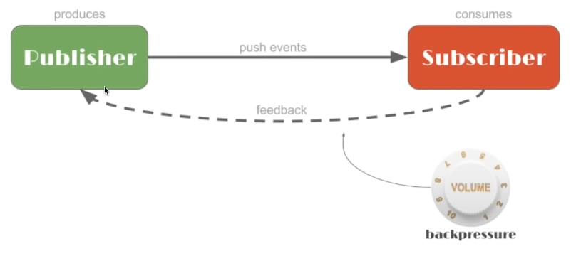

# Reactive Programming

[Introduction to Reactive Programming - Reactive Programming with Reactor 3](https://tech.io/playgrounds/929/reactive-programming-with-reactor-3/Intro)

# Keyword

- 선언적 프로그래밍
- Reactor API (Reactor Streams)
- **asynchronous**
- **non-blocking**
- data가 available하게 되면 event를 consumer에게

~~**low-level concurrent or parallelized code  를 더이상 고려할 필요가 없음.**~~

고려 X : runnable, lock, thread , callback hell... ...

thread-safety

## Reactive Streams

[GitHub - reactive-streams/reactive-streams-jvm: Reactive Streams Specification for the JVM](https://github.com/reactive-streams/reactive-streams-jvm)

: JVM기반의 라입러리

- Reactor 3
- Rxjava 2
- Akka Streams
- Vert.x
- Ratpack

등이 호환된다.

**Publicsher를 기반으로 low-level이 아니라 high-level에서 large한 범위를 커버하기를 목표로 함.**



publisher : 데이터를 보내주는 사람. → producs하면서 push events 함.

단, subscriber가 등록 되기 전까지 데이터를 보내지 않음.

subscriber는 consume하면서 feedback을 준다. ⇒ Backpressure

### specification

1. Publisher
    
    subscriber를 전달해서 subscribe함.
    
2. Subscriber
    
    subscription을 받음
    
    subscriber가 해야할 역할.
    
3. Subscription
    
    request : pull backpressure
    
4. Processor
    
    subscriber & publisher
    

## 백 프레셔

publisher가 막 data를 보내게 된다면?

subscriber에서 데이터가 막히거나 터질 수 있음.

데이터가 subscriber에 너무 많은 경우에 consumer가 몇 개만 달라고 feedback(pull)하기도 함.

### map, flatmap

- Stream 클래스
- Optional 클래스

```jsx
//flat Map
// 단일 차원 요소로 리턴 해줌.
Arrays.stream(array)
	.flatMap(inner -> Arrays.stream(inner))
	.filter(elem -> elem.equals("a"))
	.forEach(System.out::println);

// map
Arrays.stream(array)
	.map(inner -> Arrays.stream(inner))
	.forEach(elems -> elems.filter(elem -> elem.equals("a"))
		.forEach(System.out::println));
```

모나드, 모

flatmap, map

소켓 - 서블릿 - mvc

쓰레드로컬

## test

스텝베리파이어 / 어웨이틸리티